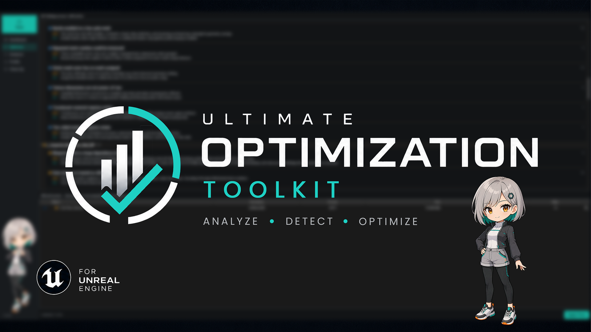

<p align="center">
  
</p>

<h1 align="center">Optimization / Profiling Toolkit</h1>

Editor-only Unreal Engine plugin for analyzing, optimizing and profiling loaded
levels from one dockable Slate panel.

## Requirements

- Unreal Engine 5.3–5.7. Version-sensitive APIs are gated in
  `ToolsetCompat.h`; each FAB package is built for one engine version.
- Built-in `AssetManagerEditor` plugin. It supplies the disk-size data used by
  Blueprint dependency analysis and project cleanup.

## Install

1. Copy the plugin to `<Project>/Plugins/OptimizationToolset`.
2. Regenerate project files and build the editor target, or let Unreal compile
   it on launch.
3. Open **Optimization Toolset** from the **Optimize** toolbar button or
   **Window → Optimization Toolset**.

## Current UI

`SOptimizeShell` owns the left navigation and a shared `FToolsetModel`. Its
single **Scan** action updates five pages:

- **Dashboard** — level statistics, severity totals, project size, analysis
  thresholds and per-level scan scope.
- **Optimize** — findings grouped by problem type and level, scope-aware
  navigation, selection and supported auto-fixes.
- **Analyzer** — loaded texture, render-target and mesh memory.
- **Profile** — stat stacks, viewport complexity modes and Nanite/Lumen/VSM
  visualizers.
- **Clean Up** — possible duplicate and unreferenced assets, redirector fixup,
  package saving and reviewed deletion.

Changing a Dashboard threshold or level-scope toggle invalidates the previous
analysis. Applying an optimization fix rescans once after the operation so all
views stay in sync.

## Source layout

```text
Source/OptimizationToolsetEditor/
  Public/Toolset/
    Analyzer/            Analyze interfaces and shared scan context
    Cleanup/             Cleanup interfaces and reports
    Optimization/        Fix interface
    OptimizationToolsetSettings.h
    ToolsetModel.h
    ToolsetRegistry.h
    ToolsetTypes.h
  Private/Toolset/
    Analyzer/Passes/     One class per analysis pass
    Cleanup/Actions/     Project-wide registry actions
    Navigation/          Finding destination routing
    Optimization/Fixes/ One class per transactional fix
    Slate/               Active UI and OptimizeStyle
    ToolsetModel.cpp
    ToolsetRegistry.cpp
```

See [Docs/ARCHITECTURE.md](Docs/ARCHITECTURE.md) for extension rules and
[Docs/HANDOFF.md](Docs/HANDOFF.md) for current status and follow-up work.

## Safety notes

- Optimization fixes use Unreal transactions where the operation supports
  Undo/Redo.
- Clean Up operations can be destructive and use Unreal's own review and delete
  dialogs.
- “Possible duplicate” is intentionally a heuristic result based on matching
  name, class and disk size across folders; it is not a content hash.
- Unreferenced does not prove unused when content is loaded dynamically by path
  or name. Review every deletion list.
